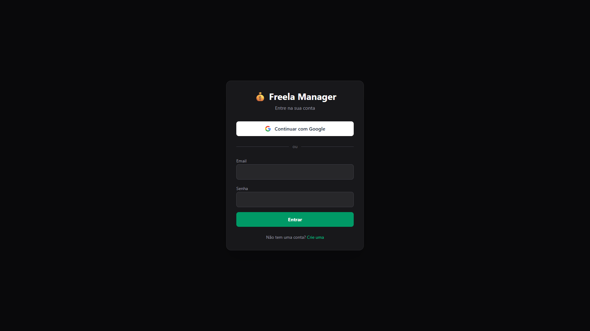
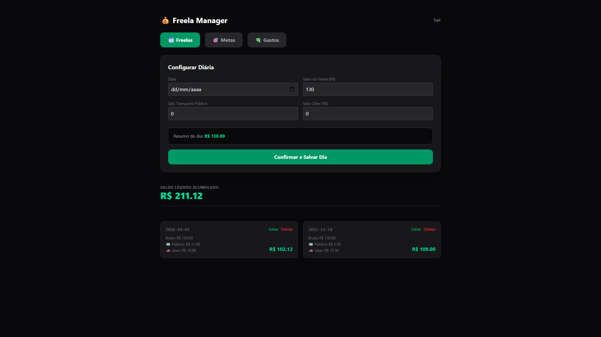
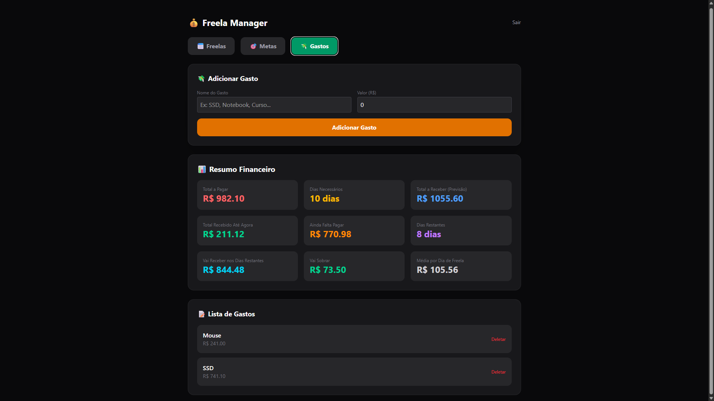
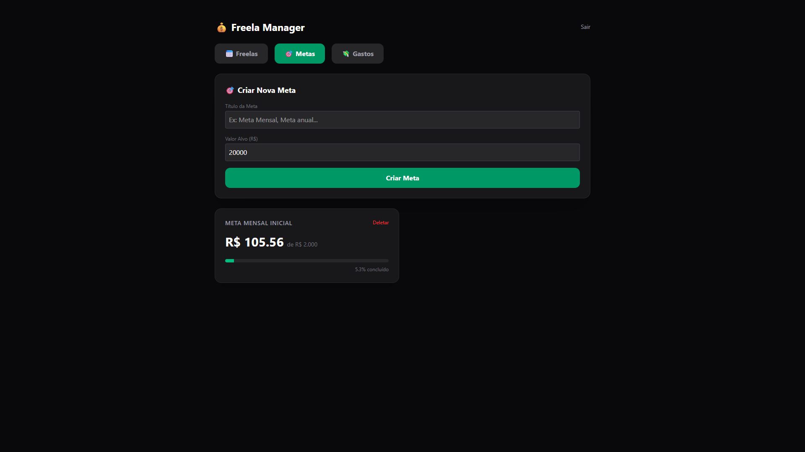

# 💰 Freela Manager

Aplicação web para gerenciar freelas, metas financeiras e despesas. Desenvolvida com React, TypeScript e Supabase.



## 🚀 [Ver Demo ao Vivo](https://freela-manager.vercel.app)

---

## 📋 Sobre o Projeto

O Freela Manager nasceu da necessidade de controlar ganhos e gastos de trabalhos freelance. A aplicação permite:

- **Gerenciar diárias de freela** com cálculo automático de valores líquidos
- **Criar metas financeiras** com acompanhamento visual de progresso
- **Planejar gastos** com previsão de dias necessários de trabalho
- **Autenticação segura** com Google OAuth ou email/senha
- **Sincronização em nuvem** - acesse de qualquer dispositivo

---

## ✨ Funcionalidades

### 📅 Gestão de Freelas
- CRUD completo de diárias
- Cálculo automático de custos (transporte público/Uber) - Uso específico para o metro de brasília, em questão ao transporte público.
- Cálculo de valor líquido por dia
- Histórico ordenado por data
- Edição e exclusão de registros

### 🎯 Metas Financeiras
- Criação de múltiplas metas
- Barra de progresso visual
- Cálculo automático baseado em média mensal
- Acompanhamento percentual

### 💸 Planejamento de Gastos
- Lista de despesas planejadas
- **9 métricas automáticas:**
  - Total a pagar
  - Dias necessários de trabalho
  - Previsão de ganhos
  - Saldo atual vs necessário
  - Dias restantes
  - Projeção de sobra

### 🔐 Autenticação
- Login com Google (OAuth)
- Login com email/senha
- Dados isolados por usuário (RLS)

---

## 🛠️ Tecnologias Utilizadas

- **Frontend:** React 18 + TypeScript
- **Estilização:** Tailwind CSS 4
- **Gerenciamento de Estado:** Context API
- **Backend/Database:** Supabase (PostgreSQL)
- **Autenticação:** Supabase Auth (OAuth + Email)
- **Build Tool:** Vite
- **Deploy:** Vercel

---

## 🎯 Conceitos Aplicados

- Context API para gerenciamento de estado global
- Custom Hooks para reutilização de lógica
- TypeScript para type safety
- Row Level Security (RLS) no banco de dados
- Componentização e separação de responsabilidades
- Cálculos financeiros complexos com `useMemo`
- Integração com APIs REST
- OAuth 2.0 (Google Sign-In)

---

## 📂 Estrutura do Projeto
```
src/
├── components/          # Componentes React
│   ├── FreelaManager.tsx
│   ├── Gastos.tsx
│   ├── Login.tsx
│   ├── MetaCard.tsx
│   ├── Metas.tsx      
│   ├── Navegacao.tsx
│   └── NumericInput.tsx
├── contexts/           # Definições de Context
│   ├── AuthContext.ts
│   └── FreelaContext.ts
├── providers/          # Providers com lógica
│   ├── AuthProvider.tsx
│   └── FreelaProvider.tsx
├── hooks/              # Custom Hooks
│   ├── useAuth.ts
│   └── useFreelaContext.ts
├── lib/                # Configurações
│   ├── supabase.ts
│   └── api.ts
└── types/              # Tipos TypeScript
    ├── Freela.ts
    ├── Meta.ts
    └── Gasto.ts
```

---

## 🚀 Como Rodar Localmente

### Pré-requisitos
- Node.js 18+
- Conta no Supabase

### Instalação
```bash
# Clone o repositório
git clone https://github.com/iGetSilly/freela-manager

# Entre na pasta
cd freela-manager

# Instale as dependências
npm install

# Configure as variáveis de ambiente
# Crie um arquivo .env.local com:
VITE_SUPABASE_URL=sua-url-do-supabase
VITE_SUPABASE_ANON_KEY=sua-chave-anon

# Rode o projeto
npm run dev
```

Acesse: `http://localhost:5173`

---

## 📊 Database Schema
```sql
-- Freelas
CREATE TABLE freelas (
  id BIGSERIAL PRIMARY KEY,
  user_id UUID REFERENCES auth.users(id),
  data DATE,
  valor_bruto DECIMAL(10,2),
  transporte_publico DECIMAL(10,2),
  transporte_uber DECIMAL(10,2),
  total_liquido DECIMAL(10,2)
);

-- Metas
CREATE TABLE metas (
  id BIGSERIAL PRIMARY KEY,
  user_id UUID REFERENCES auth.users(id),
  titulo TEXT,
  valor_alvo DECIMAL(10,2)
);

-- Gastos
CREATE TABLE gastos (
  id BIGSERIAL PRIMARY KEY,
  user_id UUID REFERENCES auth.users(id),
  nome TEXT,
  valor DECIMAL(10,2)
);
```

---

## 🎨 Screenshots

### Tela de Login


### Dashboard de Freelas


### Planejamento de Gastos


### Planejamento de Metas


---

## 📝 Aprendizados

Durante o desenvolvimento deste projeto, aprofundei conhecimentos em:

- Gerenciamento de estado complexo com Context API
- Manipulação avançada de arrays (map, filter, reduce)
- Integração com banco de dados em tempo real
- Implementação de autenticação OAuth
- Segurança de dados com Row Level Security
- Trabalho com formulários e validações
- Deploy e CI/CD

---

## 👤 Autor

**Leonardo Dutra**

- LinkedIn: [Leonardo Dutra](https://www.linkedin.com/in/leonardo-dutra-094959208/)
- GitHub: [iGetSilly](https://github.com/iGetSilly)
- Email: iuoyyp@gmail.com

---

## 📄 Licença

Este projeto está sob a licença MIT.

---